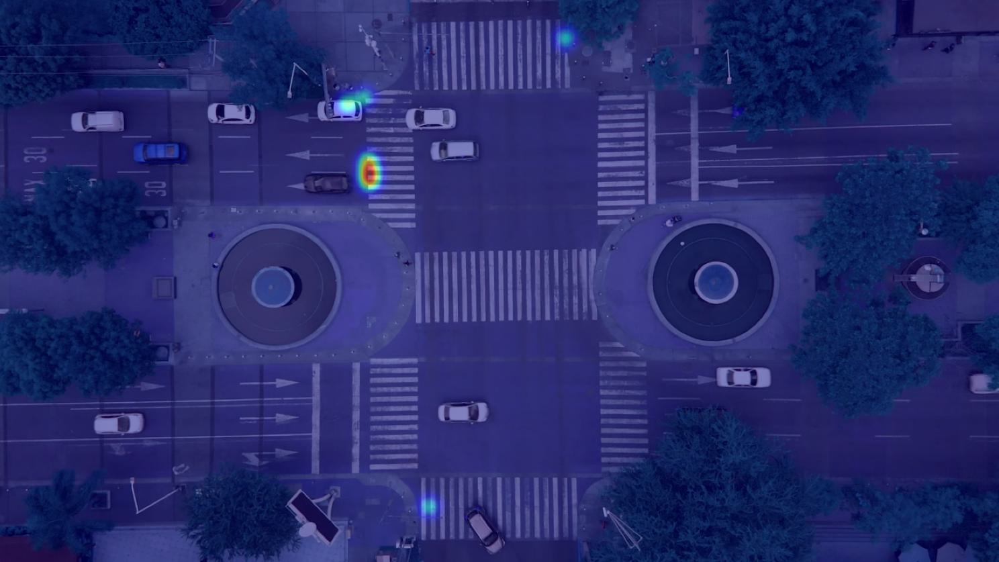

# DCT-PRB: A Dynamic Conflict Tracker Model for Drone-Based Traffic Hotspot Detection

## Potential pedestrian-vehicle conflict detection and visualization

<div align="center">
    <a href="./">
        
    </a>
</div>

## Inference (Detection ＆ tracking)
Trained weight can be downloaded ([here](https://drive.google.com/drive/folders/1NkIa2MUWFOcpTFnU3EeD34-XIhFjWGqS?usp=sharing)).
On video:
``` shell
 python DCT-PRB.py --weights weights/best.pt --source video/dowload/<video path (*.mp4)> --conf 0.5 --save-txt --img-size 1280 --trace --view-img --draw --classes 0 3 4 5 6 7 8 9
```

You will get the submmision file in 'runs/detect/exp*'

## Reference 
Detection code is based on [PRBNet_Pytorch](https://github.com/pingyang1117/PRBNet_PyTorch)

Tracking code is based on [Track5](https://github.com/NYCU-AICVLab/AICITY_2023_Track5)

by LI,GUAN-YI 2024/07/30
